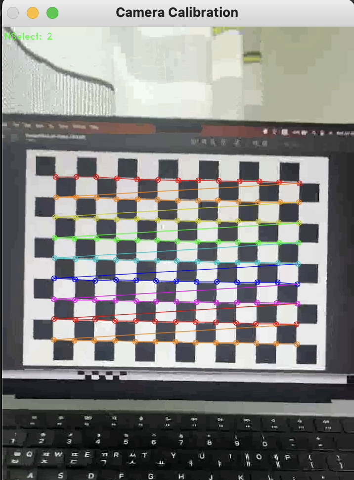
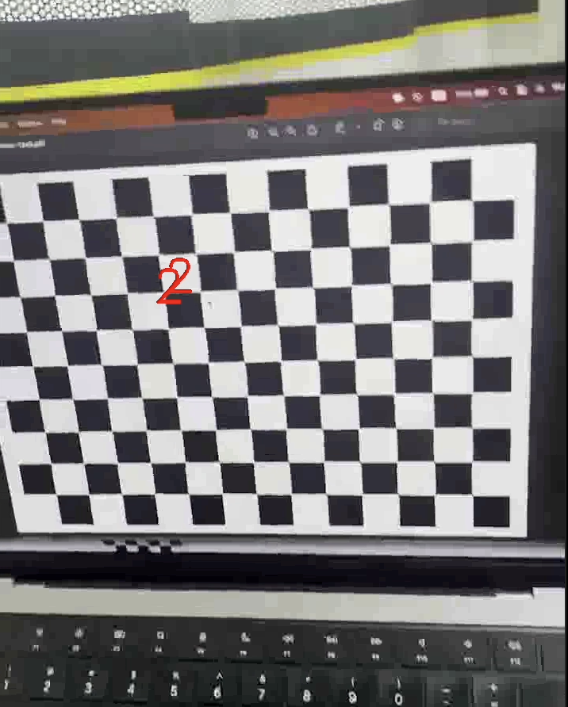

# simple-AR
camera calibration &amp; PnP

* Very simple AR using camera calibration and PnP
* Camera calibration : find intrinsic matrix and distortion coefficient, parameters of camera
  * [OpenCV docs](https://docs.opencv.org/4.x/dc/dbb/tutorial_py_calibration.html)
* PnP : Pose estimation using 3D-2D correspondences
  * [OpenCV docs](https://docs.opencv.org/3.4/d7/d53/tutorial_py_pose.html)
* If you wanna use with your own camera, you should change the camera matrix and distortion coefficient (~~please follow the insturction in the source code~~)

# Result of camera calibration
* K : intrinsic matrix
```console
[[1.05762127e+03 0.00000000e+00 3.60598208e+02]
[0.00000000e+00 1.05673443e+03 6.22182250e+02]
[0.00000000e+00 0.00000000e+00 1.00000000e+00]]
```
* Dist_coef : distortion coefficient
```console
[ 2.98849136e-01 -2.60614373e+00 -4.62963775e-04 -2.90435892e-03 8.67139039e+00]
```

# Result



# Source
* Using iphone 13 mini camera for recording
* [Checher board](https://markhedleyjones.com/projects/calibration-checkerboard-collection)
* Reference author: [Sunglok Choi](https://github.com/mint-lab/cv_tutorial)